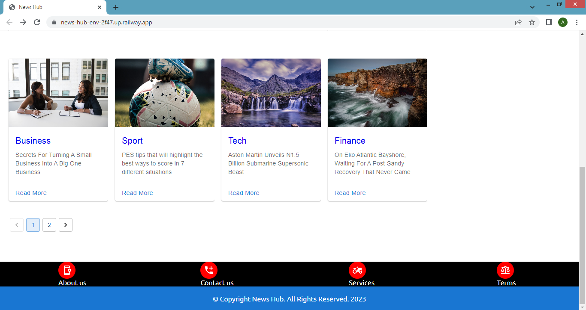

# News Hub

This is a Django-React web application that allows users to create, read and edit posts.The home
page will list all posted news from the backend, the detail page is reserved for each individual post. It also provides search and filtering functionality through API endpoints,

News Hub uses django and django rest framework for it backend and React.js as client side for fetching Api endpoints, and both served on the same server and port!

### Live Demo On

https://news-hub-env-2f47.up.railway.app/
or
https://news-hub.onrender.com/

## Technologies 

The following technologies were used for this project:

- [HTML]
- [CSS]
- [Python]
- [Django]
- [Django REST Framework]
- [PostgresSQL]
- [React.js]
- [Material Ui]
- [Redux]

## Running this App

Before Running this app, you need to have [Git](https://git-scm.com), [Python](https://www.python.org/) and [Node.js](https://nodejs.org/), installed.

## Clone the app
* `fork` and `clone` this repository.

Switch to project directory before running the below commands.

## Frontend Setup

* `cd` frontend in the project root.
* Run `npm install` to fetch the frontend dependencies.
* Run `npm start` to spin up a development server.
* Run `npm run build` to create a production build of frontend.

## Backend Setup

### Create a virtual environment

    python3 -m venv env

### Activate the virtual environment

    env/bin/activate

### Install dependencies

    pip install -r requirements.txt

### Configure Postgres

    configure postgres database

### Make migrations

    python manage.py makemigrations

### Migrate apps and database

    python manage.py migrate

### Collect Static files

    python manage.py collectstatic

### Run Tests

    python manage.py test

### Start server
  
    python manage.py runserver

## Features

 - **RESTful Api** - It follows Rest architectural style
 - **JSON Web Token -JWT** - Secure data transmission b/w this app and it users
 - **Unit Testing -Pytest** - Manually test each component to ensure it works correctly
 - **Token base authentication - Djoser** - Provides basic view for auth actions
 - **SMTP Email Server -** Email Delivery and Communication for sending and receiving email
 - **Powerful DB Queries- Filtring, Search** - This app provides refine search results of model to user
 - **React - Router** - Provide easy navigation for this app without refreshing the page
 - **Redux Toolkit** - A central store that provide easy access to data across all components

## Exploring Some endpoints Locally

Run below codes in the terminal or use any api client such as postman.

## Endpoints

The endpoints, expected payloads, and responses are described below.

## Get all news items 

### Request

`GET api/v1/posts/`

    curl -i -H 'Accept: application/json' http://127.0.0.1:8080/api/v1/posts/ 
 
### Server Response

    {
        "count": 2,
        "next": "http://127.0.0.1:8000/api/v1/posts/?page=2",
        "previous": null,
        "results": [
            {
                "title": "Lorem ipsum dolor sit amet, consectetur adipisicing",
                "slug": "lorem-ipsum-dolor-sit-amet-consectetur-adipisicing",
                "photo1": "http://127.0.0.1:8000/media/madama-potkin-cxnkcRnwS7M_Copy.jpg",
                "photo2": "http://127.0.0.1:8000/media/sample.png",
                "photo3": "http://127.0.0.1:8000/media/sample.png",
                "excerpt": "Lorem ipsum dolor sit amet, consectetur adipisicing elit.",
                "content": " "content": "Lorem ipsum dolor sit amet, consectetur adipisicing elit. In recusandae sit eligendi vitae corporis nemo, ullam perferendis, velit qui fugiat harum cumque voluptate, repellendus provident. Repudiandae dolorum dolore tempora magni?",
                "views": 1,
                "date_created":"2022-09-258T23:02:24.516803",
                "last_updated": "2022-09-258T23:02:24.516803",
                "author": "Admin",
                "category": "Sport",
                "comments": [
                    {
                        "user_name": "Admin",
                        "text": "Lorem Ipsum",
                        "post": 6
                    },
                    {
                        "user_name": "wasoln",
                        "text": "was",
                        "post": 6
                    },
                    {
                        "user_name": "wasoln",
                        "text": "Lorem Ipsum",
                        "post": 6
                    }
                ]
            },
            {
                "title": "Rorem ipsum dolor sit amet, consectetur adipisicing",
                "slug": "rorem-ipsum-dolor-sit-amet-consectetur-adipisicing",
                "photo1": "http://127.0.0.1:8000/media/sample2.jpg",
                "photo2": "http://127.0.0.1:8000/media/andw-nsplash.jpg",
                "photo3": "http://127.0.0.1:8000/media/sample.png",
                "excerpt": "Lorem ipsum dolor sit amet, consectetur adipisicing elit.",
                "content": "Lorem ipsum dolor sit amet, consectetur adipisicing elit. In recusandae sit eligendi vitae corporis nemo, ullam perferendis, velit qui fugiat harum cumque voluptate, repellendus provident. Repudiandae dolorum dolore tempora magni?",
                "views": 1,
                "date_created": "2022-09-258T23:02:34.516803",
                "last_updated": "2022-09-258T23:02:34.516803",
                "author": "Admin",
                "category": "Tech",
                "comments": []
            }
        ]
    }

## Get Posts by Category

### Request

`GET /api/v1/posts/?post_category=tech`

    curl -i -H 'Accept: application/json'  http://127.0.0.1:8000/api/v1/posts/?post_category=tech/

### Payload

    {
        "query param": <String>,
        "category type": <String>,   
    }

### Server Response

    {
        "count": 1,
        "next": "http://127.0.0.1:8000/api/v1/posts/?page=2",
        "previous": null,
        "results": [
            {
                "title": "Lorem ipsum dolor sit amet, consectetur adipisicing",
                "slug": "lorem-ipsum-dolor-sit-amet-consectetur-adipisicing",
                "photo1": "http://127.0.0.1:8000/media/madama-potkin-cxnkcRnwS7M_Copy.jpg",
                "photo2": "http://127.0.0.1:8000/media/sample.png",
                "photo3": "http://127.0.0.1:8000/media/sample.png",
                "excerpt": "Lorem ipsum dolor sit amet, consectetur adipisicing elit.",
                "content": " "content": "Lorem ipsum dolor sit amet, consectetur adipisicing elit. In recusandae sit eligendi vitae corporis nemo, ullam perferendis, velit qui fugiat harum cumque voluptate, repellendus provident. Repudiandae dolorum dolore tempora magni?",
                "views": 1,
                "date_created":"2022-09-258T23:02:24.516803",
                "last_updated": "2022-09-258T23:02:24.516803",
                "author": "Admin",
                "category": "Tech",
                "comments": [
                    {
                        "user_name": "Admin",
                        "text": "Lorem Ipsum",
                        "post": 6
                    },
                    {
                        "user_name": "wasoln",
                        "text": "was",
                        "post": 6
                    },
                    {
                        "user_name": "wasoln",
                        "text": "Lorem Ipsum",
                        "post": 6
                    }
                ]
            },

## Create a user

### Request

`POST api/v1/auth/users/`

    curl -i -H 'Accept: application/json'  http://127.0.0.1:8000/api/v1/auth/users/

### Payload

    {
        "username": <String>,
        "first_name": <String>,
        "last_name": <String>,
        "password": <String>,
        "re_password": <String>
    }

### Server Response

    {
        "access_token": <String>,
        "refresh_token": <String>,
    }

## Activate a user

### Request

`POST api/v1/auth/users/activation/`

    curl -i -H 'Accept: application/json'  http://127.0.0.1:8000/api/v1/auth/users/activation/

### Payload

    {
        "uid": <String>,
        "token": <String>,   
    }

### Server Response

    status 200 ok

## Other Endpoints

`POST /api/v1/comment/post/<post-slug>/`

`GET /api/v1/post/<str:slug>/`

`GET /api/v1/posts/?post_category=tech`
